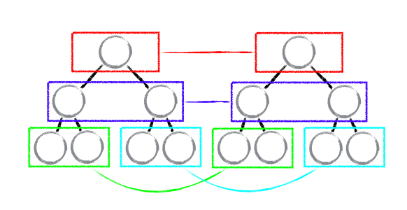

### 观前提醒

本文会提及大量【节点】一词，当你看到这个词请打醒十二分精神，当我们讨论一个【节点】时，他最多有四个关联的身份：

1. `dom节点`
2. `currentFiber`——当前屏上 dom 节点对应的 fiber 节点
3. `workInProgressFiber`——即将更新到屏上 dom 节点对应的 fiber 节点
4. `ReactElement`——组件`render`方法的返回值

**React diff 的本质是对比【2】和【4】，生成【3】的过程**，有了【3】就可以操作【1】

本文为了方便书写避免冗余，通常会简写为【节点】，具体指哪个身份，还请根据上下文推断

### Diff 概览

> React diff 通过比较两棵树差异，决定是否复用节点，计算完成转换的最少操作。
>
> 这里比较的两棵树是更新前的 Fiber 树和当前的 ReactElement 树

传统 diff 算法通过循环递归对节点进行依次对比，复杂度为O(n^3)，对普遍复杂的前端场景来说是不可接受的。因此 React 基于普遍情况提出了三个合理的前提：
1. dom 节点跨层移动操作是少有的，可以忽略
2. 相同组件对应的树是相似的，不同组件对应的树是不同的
3. 对于同一层级的兄弟节点，他们可以通过唯一的 id 区分

基于以上前提，React diff 提出三个策略，分别是 **tree diff、component diff、element diff**

#### tree diff
> dom 节点跨层移动操作是少有的，可以忽略

基于该前提，React **只会对树的同一层级节点进行比较**。如果发现跟老节点`key`相同的新新节点不存在，该老节点所在的整棵树都会被删除，避免进一步的比较



#### component diff

> 相同组件对应的树是相似的，不同组件对应的树是不同的

基于该前提，React 不会复用组件不同（`type`不同）的两个节点。如果老的节点会被删除，新的节点会被创建用于代替老节点

对于组件相同的可复用两个节点，会默认对其所在子树执行 tree diff，但开发者可以通过`shouldComponentUpdate()`来编程式的决定是否要执行该 diff


#### element diff

>对于同一层级的兄弟节点，他们可以通过唯一的 key 区分

对于处于同一层级的节点集，React diff 提供了四种节点操作：更新、移动、新增、删除

- 更新：如果一个新节点的 key 在老 key 集里，位置没发生变化且对应的组件一样，直接复用该节点
- 移动：如果一个新节点的 key 在老 key 集里，位置发生变化但对应的组件一样，说明节点可以复用，但需要调整位置
- 新增：如果一个新节点的 key 不在老 key 集里，说明是新节点，需要执行新增操作
- 删除：如果一个老节点的 key 在新 key 集里，但是对应的组件不一样，节点不能复用需要删除；或者一个老节点的 key 不在新 key 集里，说明节点需要删除

具体的逻辑可见下文《多节点 diff》

### Diff 深入

对于同层 diff，可以根据其子节点数量将 diff 分为两类（下面的`newChild`指的是 ReactElement，是 fiber 节点的前身）：

1. 当`newChild`类型为`object`、`number`、`string`，说明同级只有一个节点
2. 当`newChild`类型为`Array`，说明同级有多个节点

【注意】diff 方案的决定只与同层新子节点个数（`newChild`的类型）有关，跟更新前子节点个数无关。比如无论是从`A、B、C -> A`，还是`A -> B`都属于情况【1】，采用单节点 diff；多节点 diff 同理

下面来看下源码

```typescript
// 根据newChild类型选择不同diff函数处理
function reconcileChildFibers(
  returnFiber: Fiber,
  currentFirstChild: Fiber | null,
  newChild: any,
): Fiber | null {
  const isObject = typeof newChild === 'object' && newChild !== null;
  if (isObject) {
    // object类型，可能是 REACT_ELEMENT_TYPE 或 REACT_PORTAL_TYPE
    switch (newChild.$$typeof) {
      case REACT_ELEMENT_TYPE:
       	// 【情况1】调用 reconcileSingleElement 处理
      	// ...省略其他case
    }
  }

  if (typeof newChild === 'string' || typeof newChild === 'number') {
    // 【情况1】调用 reconcileSingleTextNode 处理
    // ...省略
  }

  if (isArray(newChild)) {
    // 【情况2】调用 reconcileChildrenArray 处理
    // ...省略
  }

  // 一些其他情况调用处理函数
  // ...省略

  // 以上都没有命中，删除节点
  return deleteRemainingChildren(returnFiber, currentFirstChild);
}
```

#### 单节点 diff

单节点 diff 逻辑对应`reconcileSingleElement()`函数，有三个主要参数

- `returnFiber`——原节集合的父节点
- `currentFirstChild`——原节点集，以链表结构表示，可通过`child.sibling`访问兄弟节点
- `element`——传入的`newChild`，即节点更新触发 render 返回的 ReactElement

单节点 diff 其实就是在遍历`currentFirstChild`，逐个跟`element`对比，并最终选择【复用/舍弃并新建】的过程


对于原节点集当前遍历到的节点`child`（跟`element`比较），有如下节点复用的判断逻辑：

1. 先比较`key`，再比较`type`，只有两者都一致时判断为可复用，将除复用节点外的其他节点标记为删除 ，然后提前返回复用节点结束`reconcileSingleElement`
2. 如果`key`相同，`type`不同，说明节点对应的组件发生了改变（compoennt diff），判断为不可复用，将原节点集都标记为删除并终止遍历
3. 如果只是`key`不相同，将当前节点`child`标记为删除，继续遍历下一个节点，重复【1-3】的逻辑
4. 如果整个遍历过程没有走到【1】的提前返回复用逻辑，只能创建新节点

`reconcileSingleElement`的具体源码可以参考[这里](https://github.com/facebook/react/blob/1fb18e22ae66fdb1dc127347e169e73948778e5a/packages/react-reconciler/src/ReactChildFiber.new.js#L1141)

```typescript
function reconcileSingleElement(
  returnFiber: Fiber,
  currentFirstChild: Fiber | null,
  element: ReactElement
): Fiber {
  const key = element.key;
  let child = currentFirstChild;
  
  // 遍历原节点集
  while (child !== null) {
    // 首先比较key是否相同
    if (child.key === key) {

      // key相同，接下来比较type是否相同
      switch (child.tag) {
        // ...省略case
        default: {
          if (child.elementType === element.type) {
            // 【情况1】key、type都相同，返回复用的fiber
            const existing = useFiber(child, element.props);
            return existing;
          }
          // type不同则跳出switch
          break;
        }
      }
      // 【情况2】key相同但是type不同
      // 将该fiber及其兄弟fiber标记为删除
      deleteRemainingChildren(returnFiber, child);
      break;
    } else {
      // 【情况3】key不同，将该fiber标记为删除
      deleteChild(returnFiber, child);
    }
    child = child.sibling;
  }

  // 创建新Fiber，并返回 ...省略
}
```

#### 多节点 diff

同层多节点更新，一定属于【更新】【新增】【删除】【移动】四种情况的组合。考虑到日常开发中【更新】更具普遍性，多节点 diff 会在第一轮遍历优先处理【更新】的节点，在第二轮遍历处理【非更新】的节点

第一轮遍历处理【更新】的节点（遍历到`key`不一致结束）：

- 从左到右同时遍历`newChildren`和`oldFibers`，进行复用判断
   - 如果`key`和`type`都相同，可以复用更新，继续遍历下一对
   - 如果是`key`相同`type`不同导致的不可复用，**终止第一次遍历**
   - 如果是`key`不同导致的不可复用，**终止第一次遍历**
- `newChildren`和`oldFibers`，只要一方遍历完成，**终止第一次遍历**


在第一轮遍历结束后，根据`newChildren`和`oldFibers`剩余节点的不同，分四种情况：

1. `newChildren`和`oldFibers`都遍历完，说明只有【更新】，**无需进行二轮遍历**
2. `newChildren`没遍历完，`oldFibers`遍历完，说明还存在【新增】，遍历剩下的`newChildren`，生成新 fiber 并标记为新增
3. `newChildren`遍历完，`oldFibers`没遍历完，说明还存在【删除】，遍历剩下的`oldFibers`标记为删除
4. `newChildren`和`oldFibers`都没遍历完，说明还存在【移动】，进行二轮遍历处理（见下）

第一轮遍历相关源码可以参考[这里](https://github.com/facebook/react/blob/1fb18e22ae66fdb1dc127347e169e73948778e5a/packages/react-reconciler/src/ReactChildFiber.new.js#L811)


___


在第一轮遍历出现【4】的情况下，需要对剩余的`newChildren`和`oldFibers`进行第二轮遍历来标记节点是否移动，这时`key`派上用场，建立`key->oldFiber`的映射`existingChildren`，方便在遍历`newChildren`时通过`key`找到对应的`oldFiber`进行比较

假设当前遍历节点对应的`oldFiber`（key相同）在`oldFibers`中的位置为`mountIndex`，并使用一个变量`lastPlacedIndex`来记录当最后一个可复用的节点在`oldFibers`中的位置（`lastPlacedIndex`初始值取决于第一轮遍历中最后一个可复用的节点在`oldFibers`中的位置），以此为参照物判断需不需要移动。现在开始遍历`newChildren`决定每个节点的具体操作：

- 节点有对应的`oldFiber`（`key`在`existingChildren`有记录）

  - 如果节点`mountIndex`大于`lastPlacedIndex`（相对靠右），不用移动，更新`lastPlacedIndex = max(lastPlacedIndex, mountIndex)`

  - 如果节点`mountIndex`小于`lastPlacedIndex`（相对靠左），需要移动，将移动操作添加到差异队列中
  - 最后将`key`记录从`existingChildren`中移除

- 遍历结束后，检查`existingChildren`中是否还有记录，将剩余的 fiber 标记为删除


PS1：从移动操作可以推断，如果尾节点要移动到头节点位置，会使`lastPlacedIndex`直接变成最大值，导致所有节点都要移动，失去加速效果影响性能，尽量避免此类操作

```typescript
function reconcileChildrenArray(
  returnFiber: Fiber,
  currentFirstChild: Fiber | null,
  newChildren: Array<*>,
  lanes: Lanes,
): Fiber | null {
  /* * returnFiber：currentFirstChild的父级fiber节点
   * currentFirstChild：当前执行更新任务的WIP（fiber）节点
   * newChildren：组件的render方法渲染出的新的ReactElement节点
   * lanes：优先级相关
   * */

  // resultingFirstChild是diff之后的新fiber链表的第一个fiber。
  let resultingFirstChild: Fiber | null = null;
  // resultingFirstChild是新链表的第一个fiber。
  // previousNewFiber用来将后续的新fiber接到第一个fiber之后
  let previousNewFiber: Fiber | null = null;

  // oldFiber节点，新的child节点会和它进行比较
  let oldFiber = currentFirstChild;
  // 存储固定节点的位置
  let lastPlacedIndex = 0;
  // 存储遍历到的新节点的索引
  let newIdx = 0;
  // 记录目前遍历到的oldFiber的下一个节点
  let nextOldFiber = null;

  // 该轮遍历来处理节点更新，依据节点是否可复用来决定是否中断遍历
  for (; oldFiber !== null && newIdx < newChildren.length; newIdx++) {
    // newChildren遍历完了，oldFiber链没有遍历完，此时需要中断遍历
    if (oldFiber.index > newIdx) {
      nextOldFiber = oldFiber;
      oldFiber = null;
    } else {
      // 用nextOldFiber存储当前遍历到的oldFiber的下一个节点
      nextOldFiber = oldFiber.sibling;
    }
    // 生成新的节点，判断key与tag是否相同就在updateSlot中
    // 对DOM类型的元素来说，key 和 tag都相同才会复用oldFiber
    // 并返回出去，否则返回null
    const newFiber = updateSlot(returnFiber, oldFiber, newChildren[newIdx], lanes);

    // newFiber为 null说明 key 或 tag 不同，节点不可复用，中断遍历
    if (newFiber === null) {
      if (oldFiber === null) {
        // oldFiber 为null说明oldFiber此时也遍历完了
        // 是以下场景，D为新增节点
        // 旧 A - B - C
        // 新 A - B - C - D oldFiber = nextOldFiber;
      }
      break;
    }
    if (shouldTrackSideEffects) {
      // shouldTrackSideEffects 为true表示是更新过程
      if (oldFiber && newFiber.alternate === null) {
        // newFiber.alternate 等同于 oldFiber.alternate
        // oldFiber为WIP节点，它的alternate 就是 current节点
        // oldFiber存在，并且经过更新后的新fiber节点它还没有current节点,
        // 说明更新后展现在屏幕上不会有current节点，而更新后WIP
        // 节点会称为current节点，所以需要删除已有的WIP节点
        deleteChild(returnFiber, oldFiber);
      }
    }
    // 记录固定节点的位置
    lastPlacedIndex = placeChild(newFiber, lastPlacedIndex, newIdx);
    // 将新fiber连接成以sibling为指针的单向链表
    if (previousNewFiber === null) {
      resultingFirstChild = newFiber;
    } else {
      previousNewFiber.sibling = newFiber;
    }
    previousNewFiber = newFiber;
    // 将oldFiber节点指向下一个，与newChildren的遍历同步移动
    oldFiber = nextOldFiber;
  }

  // 处理节点删除。新子节点遍历完，说明剩下的oldFiber都是没用的了，可以删除.
  if (newIdx === newChildren.length) {
    // newChildren遍历结束，删除掉oldFiber链中的剩下的节点
    deleteRemainingChildren(returnFiber, oldFiber);
    return resultingFirstChild;
  }

  // 处理新增节点。旧的遍历完了，能复用的都复用了，所以意味着新的都是新插入的了
  if (oldFiber === null) {
    for (; newIdx < newChildren.length; newIdx++) {
      // 基于新生成的ReactElement创建新的Fiber节点
      const newFiber = createChild(returnFiber, newChildren[newIdx], lanes);
      if (newFiber === null) {
        continue;
      }
      // 记录固定节点的位置lastPlacedIndex
      lastPlacedIndex = placeChild(newFiber, lastPlacedIndex, newIdx);
      // 将新生成的fiber节点连接成以sibling为指针的单向链表
      if (previousNewFiber === null) {
        resultingFirstChild = newFiber;
      } else {
        previousNewFiber.sibling = newFiber;
      }
      previousNewFiber = newFiber;
    }
    return resultingFirstChild;
  }
  // 执行到这是都没遍历完的情况，把剩余的旧子节点放入一个以key为键,值为oldFiber节点的map中
  // 这样在基于oldFiber节点新建新的fiber节点时，可以通过key快速地找出oldFiber
  const existingChildren = mapRemainingChildren(returnFiber, oldFiber);

  // 节点移动
  for (; newIdx < newChildren.length; newIdx++) {
    // 基于map中的oldFiber节点来创建新fiber
    const newFiber = updateFromMap(existingChildren, returnFiber, newIdx, newChildren[newIdx], lanes);
    if (newFiber !== null) {
      if (shouldTrackSideEffects) {
        if (newFiber.alternate !== null) {
          // 因为newChildren中剩余的节点有可能和oldFiber节点一样,只是位置换了，
          // 但也有可能是是新增的.

          // 如果newFiber的alternate不为空，则说明newFiber不是新增的。
          // 也就说明着它是基于map中的oldFiber节点新建的,意味着oldFiber已经被使用了,所以需
          // 要从map中删去oldFiber
          existingChildren.delete(newFiber.key === null ? newIdx : newFiber.key);
        }
      }

      // 移动节点，多节点diff的核心，这里真正会实现节点的移动
      lastPlacedIndex = placeChild(newFiber, lastPlacedIndex, newIdx);
      // 将新fiber连接成以sibling为指针的单向链表
      if (previousNewFiber === null) {
        resultingFirstChild = newFiber;
      } else {
        previousNewFiber.sibling = newFiber;
      }
      previousNewFiber = newFiber;
    }
  }
  if (shouldTrackSideEffects) {
    // 此时newChildren遍历完了，该移动的都移动了，那么删除剩下的oldFiber
    existingChildren.forEach((child) => deleteChild(returnFiber, child));
  }
  return resultingFirstChild;
}
```

### 参考

[React 源码剖析系列 － 不可思议的 react diff](https://zhuanlan.zhihu.com/p/20346379)

[React 技术揭秘](https://react.iamkasong.com/diff/prepare.html)

[React 的秘密](https://segmentfault.com/blog/react-secret)


